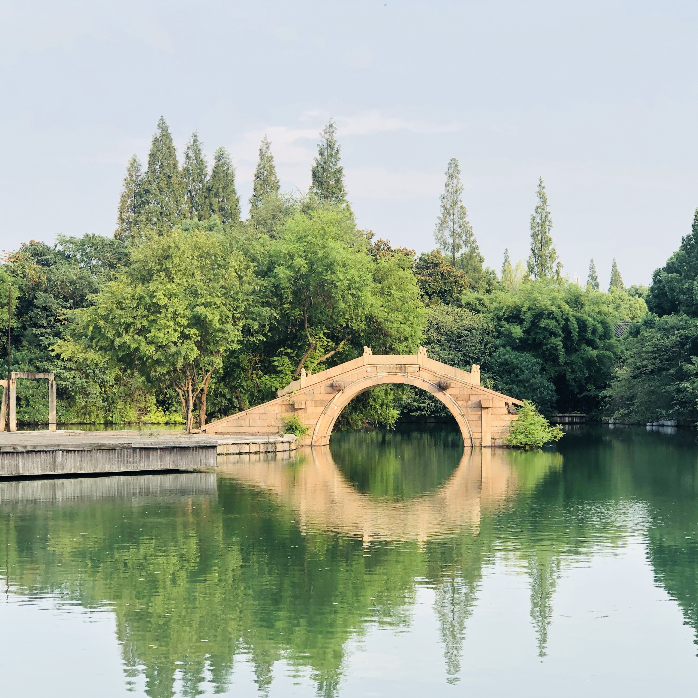
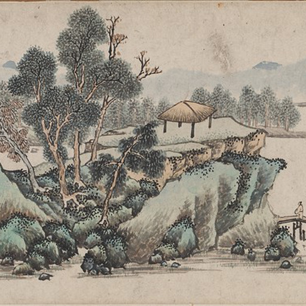
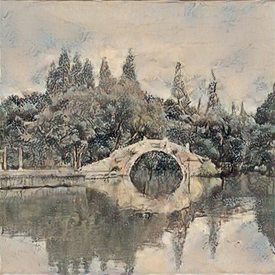
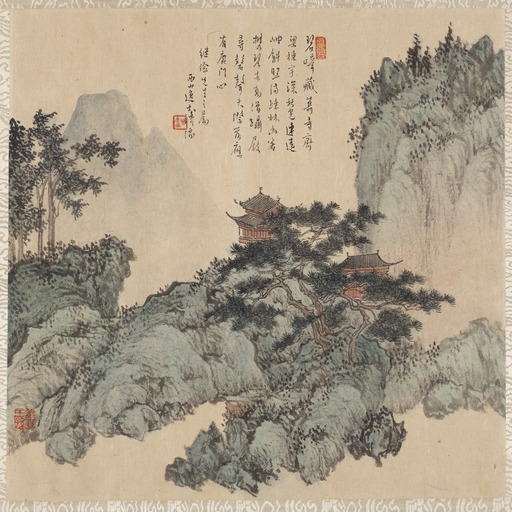
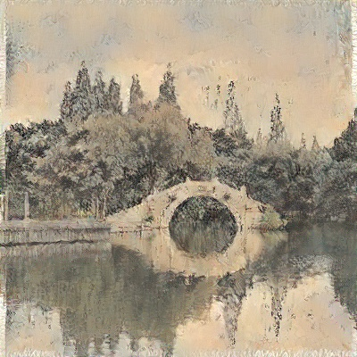

# Image-Style-Transfer-VGG

PyTorch implementation of the Image-Style-Transfer using VGG16 and VGG19


**Setup**

---

You can create an anaconda environment called `NST` using

```
conda env create -f environment.yml
conda activate NST
```

**Dataset**

---

The content images were taken by myself.

The style images were Chinese painting provided by [alicex2020](https://github.com/alicex2020)/**[Chinese-Landscape-Painting-Dataset](https://github.com/alicex2020/Chinese-Landscape-Painting-Dataset)**.

**Usage**

---

1. Edit the config file to adjust the parameters.

2. You can Put a set of config files into one folder, and you can enter multiple folders at run time.

3. ``` 
	python main.py --config_folder <folder_1> <folder_2> ...
	```

**Example result**

---
| content_img |                                |              |
| :---------: | :----------------------------: | :-----------------------------------: |
|   style_1   |    |    |
|   style_2   |  |  |
